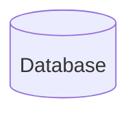

# {{ $frontmatter.title }}

::: warning
本文使用的是 mermaid 9.1.0，所以很多新功能都没有，比如说标题
:::

我们将 mermaid 里面的流程图分为三个部分来讲解

1. 节点
2. 连接
3. 样式

## 节点类型

节点主要是分为各种样式，比如说矩形，圆角矩形，菱形，圆形，椭圆，等等

1. 矩形

```mmd
graph LR
A[矩形]
```


2. 圆角矩形

```mmd
graph LR
A(圆角矩形)
```


3. 菱形

```mmd
graph LR
A{菱形}
```


4. 圆形

```mmd
graph LR
A((圆形))
```


5. 全圆角矩形

```mmd
graph LR
A([椭圆])
```


6. 子程序节点

```mmd
flowchart LR
    id1[[This is the text in the box]]
```


7. 数据库节点

```mmd
flowchart LR
    id1[(Database)]
```



除此之外,还有一些节点,但是不常用,所以在这里不介绍

## 连接


