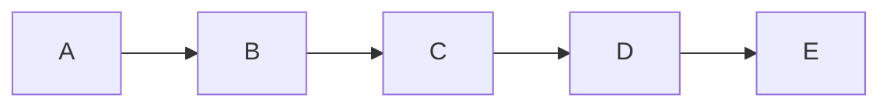
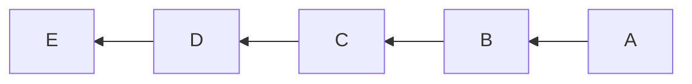
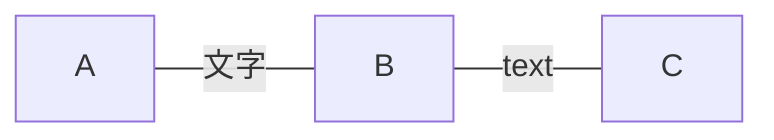

# {{ $frontmatter.title }}

::: warning
本文使用的是 mermaid 9.1.0，所以很多新功能都没有，比如说标题
:::

我们将 mermaid 里面的流程图分为五个部分来讲解

1. 节点
2. 连接
3. 子图
4. 样式
5. 链接

## 节点

### 节点排列顺序

我们可以指定排列顺序，比如说从左到右，从右到左，从上到下，从下到上，示例如下

```mmd
graph LR
    A --> B
    B --> C
    C --> D
    D --> E
```



```mmd
graph RL
    A --> B
    B --> C
    C --> D
    D --> E
```



共有四种排列顺序，分别是

1. LR，从左到右
2. RL，从右到左
3. TB，从上到下
4. BT，从下到上

### 节点文本

节点包含方框和其中的文字，节点的语法规则可以总结为

```txt
id[内容]
```

其中内容可以是如果是 ASCII 标准字符或者中文等，可以直接写入，但是如果包含 Unicode 字符，比如 ❤ ，我们就需要在文本旁边加上双引号。

如果想要使用 Markdown 文本，我们需要在旁边加上一个双引号和一个反引号，比如说

```mmd
flowchart LR
    markdown["`This **is** _Markdown_`"]
    newLines["`Line1
    Line 2
    Line 3`"]
    markdown --> newLines
```

::: warning
但很可惜，Markdown 文本功能在 9.1.0 版本中还没有实现
:::

### 节点类型

节点有各种样式，比如说矩形，圆角矩形，菱形，圆形，椭圆，等等

他的语法规则可以总结为

```txt
id[内容]
```

1. 矩形

```mmd
graph LR
A[矩形]
```


2. 圆角矩形

```mmd
graph LR
A(圆角矩形)
```


3. 菱形

```mmd
graph LR
A{菱形}
```


4. 圆形

```mmd
graph LR
A((圆形))
```


5. 全圆角矩形

```mmd
graph LR
A([椭圆])
```


6. 子程序节点

```mmd
flowchart LR
    id1[[This is the text in the box]]
```


7. 数据库节点

```mmd
flowchart LR
    id1[(Database)]
```


除此之外,还有一些节点,但是不常用,所以在这里不介绍

## 连接

### 连接样式

看到这里莫名感叹 mermaid 很类似象形文字，因为他的连接也很生动，比如直线，箭头，虚线等

| 连接类型 | 效果     |
| -------- | -------- |
| -->      | 箭头     |
| ---      | 直线     |
| -.-      | 虚线     |
| -.->     | 虚线箭头 |
| ===      | 粗直线   |
| ==>      | 粗箭头   |

```mmd
graph LR
    A --> B
    B --- C
    C -.- D
    D -.-> E
    E === F
    F ==> G
```


### 连接长度

我们还可以辅助以长度，用不同的字符个数来表示不同的长度，共有三种长度，最短共三个字符，中等为四个字符，最长共五个字符，示例如下

| 长度  | 效果   |
| ----- | ------ |
| ---   | 默认   |
| ----  | 两倍长 |
| ----- | 三倍长 |
| -->   | 默认   |
| --->  | 两倍长 |
| ----> | 三倍长 |

```mmd
graph LR
    A --- B
    B ---- C
    C ----- D
    D --> E
    E ---> F
    F ----> G
```


### 连接文本

如果我们想要连接的两个节点之间有文字，我们可以在连接符号最后加上一对 `|` 符号，然后在中间加上文字，或者在文本前面加上两个连接所用的符号，示例如下

```mmd
graph LR
    A ---|文字| B
    B -- text --- C
```



## 子图
