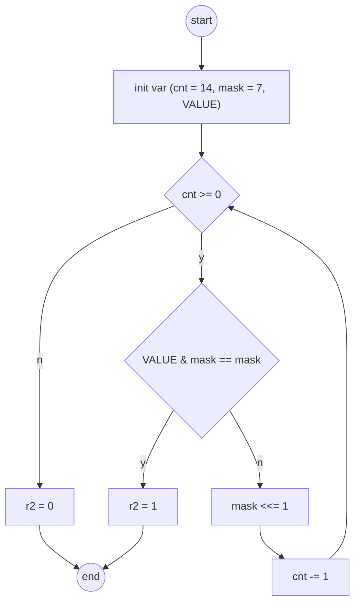

# {{ $frontmatter.title }}

## algorithm



<!--  -->

the bin file code as listed

## code

```asm
0011 0000 0000 0000 ; start from x3000
0010 0000 1111 1111 ; load value

0101 0010 0110 0000 ; load MASK and cnt
0001 0010 0110 0111
0101 1001 0010 0000
0001 1001 0010 1110

0101 0100 1010 0000 ; clear r2

0101 0110 0000 0001 ; r3 = r0 & r1
1001 1010 0111 1111 ; if r3 - r1 == 0, then r2 = 1, and r5 = -r1
0001 1011 0110 0001
0001 0110 1100 0101
0000 0100 0000 0100

0001 0010 0100 0001 ; r1 = r1 << 1
0001 1001 0011 1111 ; r4 = r4 - 1

0000 0100 0000 0010 ; if r4 != 0, then jump to NOTHAS, which means return 0
0000 1111 1111 0111

0001 0100 1010 0001 ; r2 = r2 + 1, which means has 111 pattern
1111 0000 0010 0101 ; halt
```

## Q&A

> if we need get the pattern 1111, how to change the code?

1. change the cnt from 14 to 13
2. change the mask from 7 to 15

## points to note

1. we write asm at first, then convert it to mechine code, however persudo code should be translate manually, such as `.orig x3000`
2. don't init var by using .fill persudo code, because it can't be translated to mechine code, should use `add rx, ry, 0` to init code
