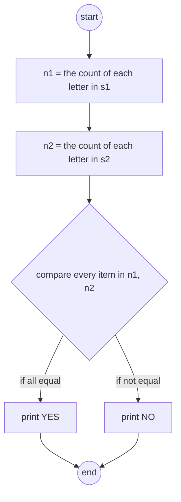

# {{ $frontmatter.title }}

## algorithm



<!--  -->

## code

```asm
; while (s1) set char for a1
loop1
    ; s1++
    add r1, r1, 1
    ; if r3 == " ", then goto loop1, equal with continue
    ld r4, space
    add r4, r3, r4
    brz loop1

    ; make a to A, A to A
    ; r3 = r3 - 65
    ...
set1
    ; r5 = &m[index]
    ...
    brnzp loop1

; while (s2) set char for a2
loop2
    ; s2++
    add r2, r2, 1
    ; if r3 == " ", then goto loop2, equal with continue
    ld r4, space
    add r4, r3, r4
    brz loop2

    same as loop1

; compare the char num of s1, s2, if all equal, print true
compare
    ; r1 = &a1[0]; r2 = &a2[0]
    lea r1, a1
    lea r2, a2
    ; loop for 26 times, if one item not equal, goto notEqual, else goto Equal
    ; details as follow
    ; while(r3 >= 0) do
    ;   if a1[r3] != a2[r3] goto notEqual
    ;   r3--
    ; at first r3 = 25
loop3
    ; r4 = a1[r3]; r5 = a2[r3]
    ...
    ; if r4 - r5 == 0 goto notEqual
    brnp notEqual
    ...
    brzp loop3

Equal
    ...
    halt

notEqual
    ...
    halt


; place to store string addr
...
.end

; place to store string addr
.orig x4000
.FILL str1
.FILL str2
str1 .STRINGZ "listen"
str2 .STRINGZ "slient"
.end
```

## Q&A

> how to get the addr of str1 and str2

because the addr of str1 and str2 was placed at x4000, such as str1 located at x4007, the value of x4000 is x4007, so we need use instructino `ld` or `ldi` to get, but there also exist one problem, is that the param of `ld` or `ldi` is 9-bits length, we can reach x4000, so store at `x3...`, then use `ldi` to get these addr
